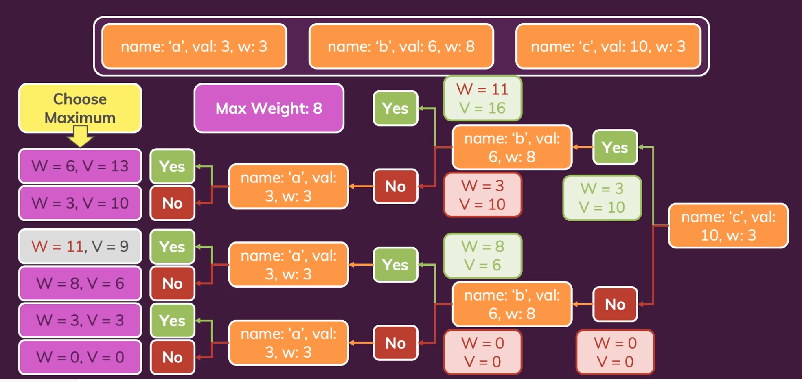

## Knapsack Problem

You have a list of items where every item has a value and weight.
You also have a bag the holds a maximum weight of X.

Write a program that maximises the value of items in the bag.
Make sure you do not exceed the maximum weight.

Test case:

```
items = [
    { id: 'a', value: 3, weight: 3 },
    { id: 'b', value: 6, weight: 8 },
    { id: 'c', value: 10, weight: 3 }
]

maxWeight = 8

bag = [ 'a', 'c' ] //solution
```
-------

### Verify the problem
- Verify inputs: Can we use the items multiple times?
  - Here let's assume we can not have multiple items

### Derive first (verbal) solution
We could derive all possible combinations (without repetitions) and find the one with the highest value and fitting weight.
Note: Permutations first come to mind, however, it is not the correct approach as permutations only worry about the order of *all items*. Try running the `permutationsWithoutReps` method with the items and you will see the function finds all possible orders using all items.

### Re-thinking the solution
Evaluate all the possible cases / solutions.
We can illustrate the possible cases using the following decision tree.



-------
## Knapsack with Memoization
Recursive is not always the best solution.

Remember the Fibonacci recursive solution, an issue we had with that solution was we
had repeated branches. That is when we have a lot of repeated executions. This issue
is also seen in the recursive knapsack solution.

We can improve our algorithm by reducing the number of function calls, this is done by
memoization. This is an object that can keep track of our results, so we can check
this object and see if we already have a solution for a particular input.

A good way to see this is to uncomment the `console.log('Running')` lines in both the knapsack
files, run the tests then count how many times the function was executed.

What happens if we add another item in the `items` array? eg:
```
  let items = [
    { id: 'a', value: 3, weight: 3 },
    { id: 'b', value: 6, weight: 8 },
    { id: 'c', value: 10, weight: 3 }
    { id: 'd', value: 2, weight: 2 }
  ]
```
Compare the executions again.
